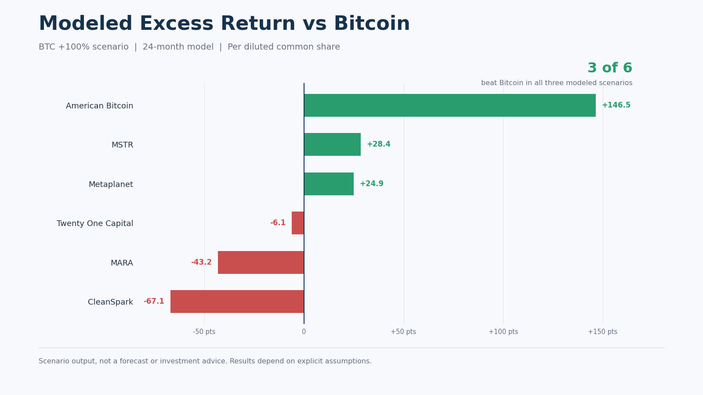

# AI-Augmented Bitcoin Proxy Analysis

## Project overview

This project rebuilds a more code-heavy Bitcoin proxy analysis completed in June 2025 as a ChatGPT-centered, AI-augmented decision system.

The objective was not simply to identify stocks correlated with Bitcoin. The central question was:

> Can a publicly traded Bitcoin proxy create greater value per diluted common share than owning Bitcoin directly during a major bull market?

The analysis evaluates six public companies—MSTR, Metaplanet, Twenty One Capital, American Bitcoin, CleanSpark, and MARA—across three 24-month Bitcoin scenarios. It incorporates dilution, senior claims, mining difficulty, capital expenditure, operating costs, and execution risk.

The earlier project is preserved separately for comparison: [proxy-investing-btc-MSTR-MTPLF](https://github.com/markjamesc/proxy-investing-btc-MSTR-MTPLF).

## Five-stage analytical workflow

1. **Start** — Define three real decisions: own BTC directly, own a proxy, or reject the proxy opportunity.
2. **Framing** — Convert those alternatives into one benchmarked question focused on value per diluted common share.
3. **Design** — Establish hypotheses, KPIs, source requirements, confounders, and decision rules before modeling.
4. **Execution** — Normalize market, network, filing, capital-structure, mining, and HPC inputs; build 18 company-scenario observations; run model checks.
5. **Finish** — Interpret the evidence, rank the companies, state uncertainty, and recommend an investment role for each candidate.

## Primary KPI

**Modeled excess return versus Bitcoin**

`Proxy stock return − Bitcoin return under the same scenario`

The controlling unit is one diluted common share. Total Bitcoin holdings or headline production growth do not count as shareholder value creation unless the benefit survives dilution and senior claims.

## Scenario design

| Scenario | Terminal BTC price | BTC return | Mining difficulty increase | Horizon |
|---|---:|---:|---:|---:|
| BTC +50% | $117,766.85 | +50% | +25% | 24 months |
| BTC +100% | $157,022.46 | +100% | +45% | 24 months |
| BTC +200% | $235,533.69 | +200% | +80% | 24 months |

Bitcoin anchor: **$78,511.23**.

## Main result

Only three of the six companies beat Bitcoin in all three modeled scenarios:

| Rank | Company | Role | Stock return if BTC rises 100% | Excess return vs. BTC | Scenarios beating BTC |
|---:|---|---|---:|---:|---:|
| 1 | MSTR | Best overall proxy | 128.4% | +28.4 pts | 3 / 3 |
| 2 | Metaplanet | Risk-adjusted alternative | 124.9% | +24.9 pts | 3 / 3 |
| 3 | American Bitcoin | Maximum convexity | 246.5% | +146.5 pts | 3 / 3 |
| 4 | Twenty One Capital | Discount special situation | 93.9% | −6.1 pts | 0 / 3 |
| 5 | CleanSpark | Diversified mining/HPC | 32.9% | −67.1 pts | 0 / 3 |
| 6 | MARA | High-beta BTC trade | 56.8% | −43.2 pts | 0 / 3 |

## Interpretation

- **MSTR** is the best overall choice when the objective is the highest credible probability of outperforming Bitcoin.
- **Metaplanet** offers the strongest middle ground between valuation, leverage, and execution quality.
- **American Bitcoin** has the greatest modeled upside, but also carries substantial ATM, dilution, mining, and execution risk.
- **Twenty One Capital, CleanSpark, and MARA** may produce positive stock returns, but they fail the actual benchmark in the rebuilt model.

The final decision is therefore to choose the proxy opportunity selectively rather than treating every Bitcoin-sensitive equity as superior to direct BTC ownership.

## Model validation

These are internal consistency and execution checks recorded in the committed workbook and notebook. They do not constitute external validation of future investment outcomes.

- 18 of 18 company-scenario observations rebuilt
- 0 missing target prices
- 0 detected formula errors
- 12 of 12 workbook execution assertions passed
- 6 of 6 notebook QA checks passed

## Repository contents

| File | Purpose |
|---|---|
| [Report PDF](deliverables/AI_Augmented_Bitcoin_Proxy_Analysis_Report.pdf) | Detailed employer-facing report covering all five stages |
| [Presentation](deliverables/AI_Augmented_Bitcoin_Proxy_Analysis_Presentation.pptx) | Concise 15-slide presentation for interviews and portfolio review |
| [Model workbook](model/Bitcoin_Proxy_Stage5_Input.xlsx) | Normalized evidence, assumptions, scenario outputs, sources, gaps, and checks |
| [Executed notebook](model/Stage4_Model_Rebuild.ipynb) | Model rebuild and six internal QA checks |
| [Editable report](deliverables/AI_Augmented_Bitcoin_Proxy_Analysis_Report.docx) | Editable report source |

## Source architecture

The project combines:

- Token Terminal for Bitcoin market context
- Mempool and network research for difficulty, hashrate, and revenue mix
- Company investor-relations materials and SEC filings for capital structures, Bitcoin holdings, financing, mining, and HPC inputs
- A normalized Excel model and executed notebook as the controlling analytical source

## Skills demonstrated

- Decision framing and KPI design
- Research synthesis and source normalization
- Financial and scenario modeling
- Diluted-share and capital-structure analysis
- Notebook-based model validation
- Risk-aware interpretation
- Executive reporting and presentation design
- AI-augmented analytical orchestration

## Important limitation

This is a portfolio case study, not investment advice. The results are conditional on explicit 24-month assumptions and rapidly changing company disclosures, prices, financing structures, and Bitcoin network conditions.

## Related portfolio work

- [Five-Stage AI-Augmented Analyst Workflow](https://github.com/markjamesc/ai-augmented-analyst-workflow)
- [FulfillIQ — MySQL and R Decision-Support Case Study](https://github.com/markjamesc/fulfilliq)
- [R Workflow Engine](https://github.com/markjamesc/r-workflow-engine)
